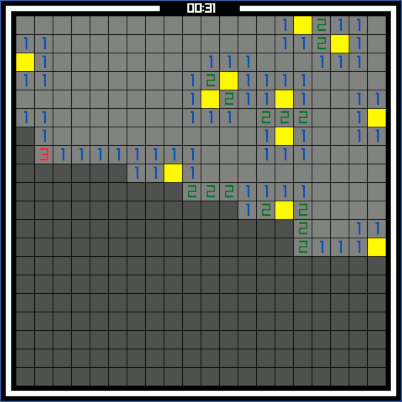

# 🕹️ Minisweep

A classic minesweeper game built in C with raylib. 

## Table of Contents

- [Features](#features)
- [Screenshots](#screenshots)
- [Installation](#installation)
  - [Debian](#debian)
  - [Fedora](#fedora)
  - [macOS](#macos)
- [Gameplay](#gameplay)

## Features

- Classic minesweeper gameplay
- Multiple themes
- Easy installation and setup
- Built using [raylib](https://www.raylib.com/)

## Screenshots

*Pressing F1 allow for switching theme at any time*




## Installation

### Debian

Install raylib:

```sh
  sudo apt install libraylib-dev
```

Clone the repository and build the game:

```sh
  git clone https://github.com/agiraude/minisweep.git
  cd minisweep
  make
```
### Fedora

Install raylib:

```sh
  sudo dnf install raylib-devel
```

Clone the repository and build the game:

```sh
  git clone https://github.com/agiraude/minisweep.git
  cd minisweep
  make
```

### macOS

Install Homebrew if you haven't already:

```sh
  /bin/bash -c "$(curl -fsSL https://raw.githubusercontent.com/Homebrew/install/HEAD/install.sh)"
```

Install dependencies:

```sh
  brew install make gcc raylib
```

Clone the repository and build the game:

```sh
  git clone https://github.com/agiraude/minisweep.git
  cd minisweep
  make
```

**Warning:** on macOS, you might need to specify the path of the libs install via homebrew yourself. If you encounter issues, try to correct those lines in the Makefile:
```Makefile
  LIB_DIR := /opt/homebrew/opt/raylib/lib
  LIB_INC_DIR := /opt/homebrew/opt/raylib/include
```

## Gameplay

MiniSweep is a classic minesweeper game with the added ability to change themes. Here's a quick rundown of the gameplay mechanics:

**Objective**: Reveal all the squares on the grid that do not contain mines.

**Revealing Squares**: Click on a square to reveal it. If it contains a mine, you lose the game.

**Numbers**: Revealed squares show numbers indicating how many mines are adjacent to that square.

**Flagging Mines**: Right-click to flag a square that you believe contains a mine.

**Quick Reveal**: If you click on a revealed square that has a number, and the number of adjacent flagged squares matches that number, all adjacent non-flagged squares will be revealed.

**Theme change**: You can change theme from the main menu, or by pressing F1 while in game.

Enjoy the game!

Feel free to contribute to the project by submitting issues or pull requests on the GitHub repository.

Happy Sweeping!

## License

This project is licensed under the Creative Commons Attribution-NonCommercial 4.0 International License - see the [LICENSE](LICENSE) file for details.
